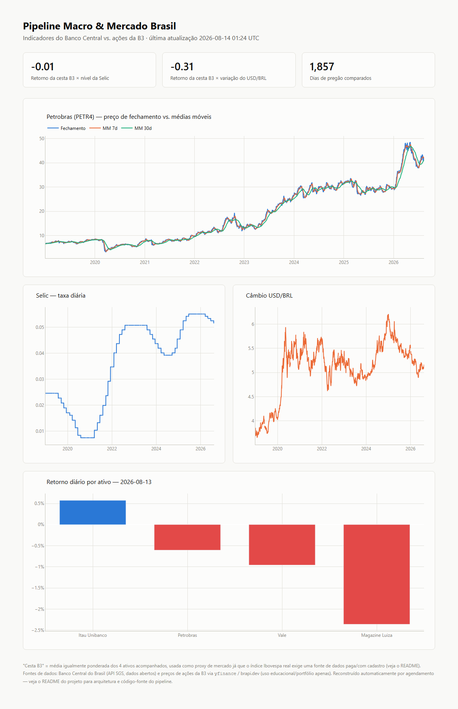
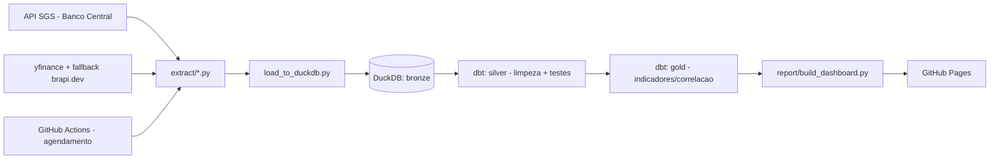

# Pipeline Macro & Mercado Brasil

[](https://github.com/EduardoFernandes7/pipeline-macro-mercado-brasil/actions/workflows/pipeline.yml)
[](status/status.json)
[](LICENSE)

Pipeline de engenharia de dados ponta a ponta que cruza indicadores macroeconômicos do Banco Central do Brasil com preços de ações da B3: extração, carga, transformação com testes automatizados de qualidade, e publicação de um dashboard interativo — tudo gratuito e atualizado sozinho por agendamento.

**[Ver o dashboard ao vivo →](https://eduardofernandes7.github.io/pipeline-macro-mercado-brasil/)**



## O que este projeto mostra

- **Pipeline ELT completo**: extração de APIs reais → camada bronze (dados brutos) → silver (limpo e testado) → gold (pronto para análise), seguindo a arquitetura medallion.
- **Qualidade de dados como parte do pipeline**, não uma etapa separada: 21 testes automatizados do dbt (`not_null`, `unique`, valores dentro de faixa aceitável) rodam a cada execução.
- **Resiliência de verdade contra APIs instáveis**: retry com backoff exponencial e uma fonte alternativa quando a principal falha (ver "Decisões técnicas" abaixo — isso não é teórico, aconteceu durante a construção deste projeto).
- **Orquestração e publicação automatizadas** via GitHub Actions: o pipeline roda sozinho em um agendamento, publica o relatório no GitHub Pages, e mantém um heartbeat de status.

## Arquitetura



## Stack

Python · DuckDB · dbt-core + dbt-duckdb · Plotly · GitHub Actions · GitHub Pages

## Fontes de dados

| Fonte | Dados | Observação |
|---|---|---|
| [API SGS do Banco Central](https://dadosabertos.bcb.gov.br/) | Selic diária, IPCA mensal, câmbio USD/BRL | Gratuita, sem chave, dados públicos abertos |
| [yfinance](https://github.com/ranaroussi/yfinance) | Preços diários de 4 ações da B3 | Scraper não-oficial do Yahoo Finance — uso educacional |
| [brapi.dev](https://brapi.dev/) | Fallback para os mesmos 4 ativos | API brasileira, camada gratuita sem chave para PETR4, VALE3, ITUB4, MGLU3 |

**Nota**: não há uma fonte gratuita e sem cadastro para o índice Ibovespa real, então o dashboard usa uma "cesta B3" (média igualmente ponderada dos 4 ativos acompanhados) como proxy de mercado — deixado explícito no próprio relatório, não escondido.

## Decisões técnicas (e os problemas reais que apareceram)

- **yfinance quebrou em produção, ao vivo, durante a construção deste projeto** — todas as chamadas retornaram `YFRateLimitError`. A camada de fallback para `brapi.dev` foi o que manteve o pipeline funcionando; sem ela, o projeto simplesmente não teria dados de mercado.
- **O fallback original (stooq.com) também não funcionou** — tinha ficado protegido por verificação anti-bot desde que a estratégia foi planejada. Troquei por `brapi.dev`, que é purpose-built para ativos da B3.
- **Full-refresh idempotente em vez de carga incremental**: como as duas fontes devolvem o histórico completo de graça, reconstruir tudo do zero a cada execução é mais simples do que reconciliar dados novos com antigos, e foi validado rodando o pipeline duas vezes seguidas e comparando contagem de linhas.
- **Forward-fill do IPCA com SQL portátil**: o IPCA só publica uma vez por mês; em vez de depender de uma função específica de um banco, o modelo `gold_macro_wide` usa uma contagem cumulativa como "grupo de preenchimento" — um padrão de SQL que funciona em qualquer engine com window functions.
- **`generate_schema_name` customizado**: por padrão o dbt cria os schemas como `main_silver`/`main_gold` (concatenando com o schema alvo). Sobrescrevi a macro para usar o nome customizado como está — comportamento padrão documentado pelo próprio dbt Labs, mas fácil de não saber até esbarrar nele.
- **Heartbeat de status commitado a cada execução** (`status/status.json` e `status/badge.json`): resolve dois problemas de uma vez — vira o badge de status acima, e por ser um push de verdade, reseta o contador de 60 dias que o GitHub usa para desativar workflows agendados por inatividade.

## Estrutura do repositório

```
extract/    -> scripts de extração (Banco Central + mercado)
load/       -> carga bronze no DuckDB
transform/  -> projeto dbt (models bronze/silver/gold + testes)
report/     -> geração do dashboard estático (Plotly)
status/     -> heartbeat de execução (status.json / badge.json)
.github/    -> workflow do GitHub Actions (build + deploy)
```

## Como rodar localmente

```bash
python -m venv .venv
.venv\Scripts\activate          # Windows
pip install -r requirements.txt

python -m load.load_to_duckdb   # extrai e carrega a camada bronze
cd transform && dbt deps && dbt build && cd ..
python -m report.build_dashboard  # gera site/index.html
python -m status.write_status
```

## Roadmap do portfólio

Este é o projeto 1 de 3 num portfólio de dados mais amplo, cada um combinando um tema diferente com uma stack diferente:

| # | Tema | Foco | Stack |
|---|------|------|-------|
| 1 | Macro & mercado brasileiro (este repo) | Engenharia de Dados | Python, DuckDB, dbt, GitHub Actions, GitHub Pages |
| 2 | Análise esportiva | Análise de Dados | Notebooks/Quarto, Plotly |
| 3 | E-commerce/varejo | Cloud + BI | AWS/GCP free tier |

## Licença

MIT — veja [LICENSE](LICENSE).
